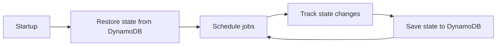
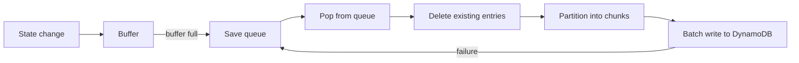

# AGENTS.md

This file provides guidance to AI coding agents working with code in this repository.

## What is Tron?

Tron is Yelp's centralized batch job scheduling system—a distributed alternative to cron for managing periodic batch processes across a cluster.

### Core Concepts

**Jobs** are DAGs (directed acyclic graphs) defined in YAML configuration. Each job contains one or more **Actions** (individual commands) with dependency relationships between them.

**JobRuns** are instances of a job execution. If a job runs daily, each execution creates a new JobRun containing **ActionRuns** for each action. Tron tracks each run independently.

### Lifecycle



### State Persistence

Tron persists all job and run state to DynamoDB. 101 consecutive save errors triggers intentional crash (prevents running degraded).



### Execution Backends

- **Kubernetes**: Primary execution backend
- **SSH**: Legacy backend for remote command execution, do not extend
- **Mesos**: Deprecated, do not extend

## Project Structure

```
tron/
├── core/           # Job, Action, JobRun, scheduling, dependency graphs
├── config/         # YAML config parsing and schema definitions
├── serialize/      # State persistence (DynamoDB, shelve backends)
├── api/            # REST API endpoints and adapters
├── kubernetes.py   # Kubernetes execution backend
└── mesos.py        # Deprecated - do not modify

tronweb/            # Web UI (CoffeeScript/Backbone.js)
bin/                # CLI: trond, tronctl, tronview, tronfig
```

## Testing

Tox manages the virtualenv in `.tox/py310/`. Use `make test` for the full suite, or iterate with pytest directly:

```bash
.tox/py310/bin/pytest tests/path/to/test.py -x
```

## Development Guardrails

### High-risk areas

**DynamoDB/Persistence changes:**
- Pickle deserialization is still active—deleting or renaming persisted classes/fields breaks restore
- Reverting changes that add new persisted fields is NOT safe
- Writes batch 8 partitions at a time; large jobs needing more can be partially written if a later batch fails

**Job/action schema changes** require updates in two repos:
- Tron: `tron/config/schema.py`, `tron/core/action.py` (including `from_json`/`to_json`)
- PaaSTA: `paasta_tools/cli/schemas/tron_schema.json`, `paasta_tools/tron_tools.py`
- Plus: tests in both repos, and any code that consumes the new field

**MASTER config changes**:
- `tron/config/schema.py` — Add field to config object
- `tron/config/config_parse.py` — Add default value and validator
- Plus: tests, and any code that consumes the new config value

Reverting config changes is risky: new params get written to MASTER.yaml on disk, so reverting code requires manual config cleanup on servers.

### Do not modify

- `tron/mesos.py` — Deprecated
- `tron/ssh.py` - Deprecated
- `tron/node.py` - Deprecated


- DynamoDB schema without approval
